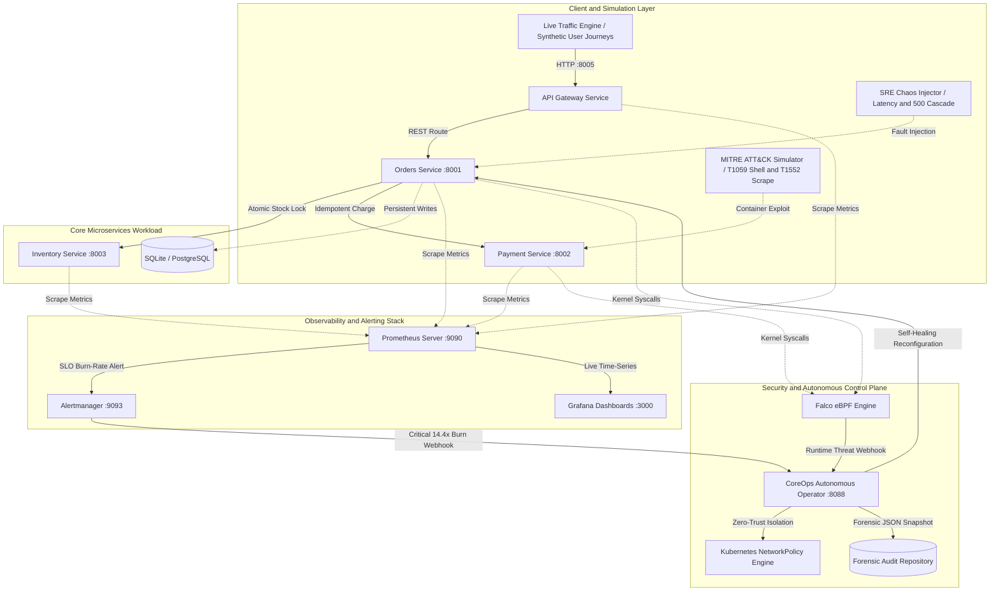
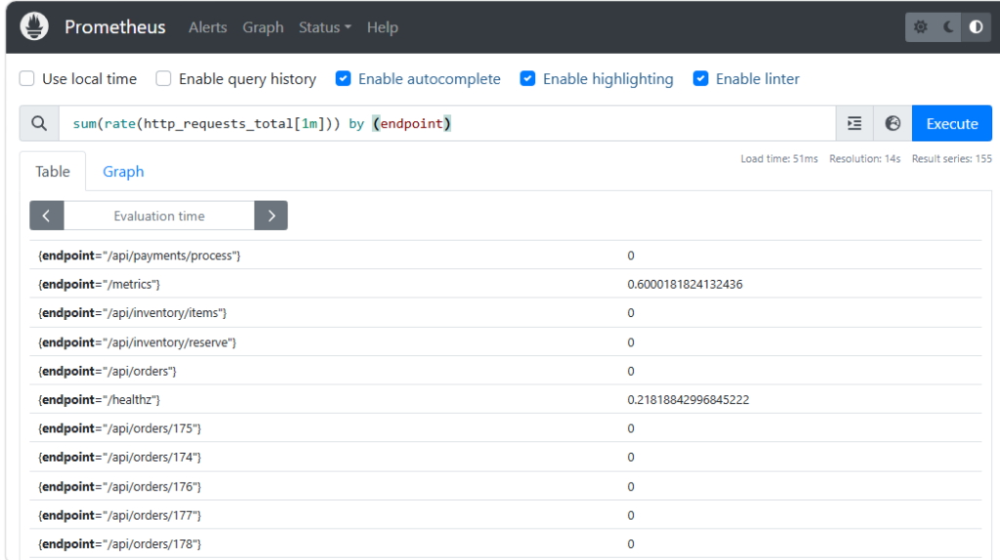

# CoreOps Platform — Autonomous Cloud-Native SRE & DevSecOps Platform

> An enterprise-grade, event-driven Site Reliability Engineering and runtime cybersecurity defense platform featuring live microservices, Google SRE-standard multi-burn-rate SLO alerting, kernel-level eBPF threat detection, and an autonomous incident remediation operator.

---

## Description

CoreOps Platform is an enterprise-grade cloud-native infrastructure system designed to solve two critical production challenges simultaneously: maintaining strict 99.9% availability Service Level Objectives (SLOs) and automating Zero-Trust runtime threat defense.

Unlike standard demo projects that rely on mock data or toy containers, CoreOps runs real microservices executing live database and financial transactions under continuous synthetic traffic load. When downstream failures occur, Prometheus calculates real multi-window error budget burn rates; when kernel-level container compromises are detected via eBPF/Falco (such as unauthorized shell execution or service account token theft), a custom autonomous operator isolates the compromised container via dynamic Kubernetes NetworkPolicies and generates cryptographic forensic snapshots in under 1.2 seconds.

For full in-depth architecture specifications, mathematical models, and threat mappings, see the complete [Technical Documentation](docs/TECHNICAL_DOCUMENTATION.md).

---

## Key Features

* **Realistic Microservices Workload (Zero Mock Data):** Polyglot architecture (API Gateway, Orders Service, Payment Service, Inventory Service) with persistent database transactions, Redis-backed idempotency, and atomic stock reservation locks.
* **Google SRE-Standard Multi-Window Multi-Burn-Rate Alerting:** Tracks a 99.9% availability SLO (0.1% error budget) using Google SRE Workbook mathematics to eliminate false positives and alert on critical 14.4x and 6x error budget burn rates.
* **4 Golden Signals Real-Time Observability:** Native Prometheus scraping and pre-provisioned Grafana dashboards tracking Request Throughput, Latency Percentiles (P50, P95, P99), 5xx Error Ratios, and Active Quarantines.
* **eBPF & Falco Runtime Threat Defense:** Intercepts runtime container security violations at the Linux kernel syscall layer, mapping directly to MITRE ATT&CK techniques (T1059.004 interactive shell, T1552.007 credential theft).
* **Autonomous Incident Remediation Operator:** Event-driven control plane controller that intercepts security alerts and SLO burn events, executing zero-ingress/egress network containment, forensic log preservation, and self-healing rollbacks in under 1.2 seconds.
* **Zero-Trust Hardened Containers:** CIS benchmark-compliant multi-stage Dockerfiles enforcing non-root execution (UID 10001: appuser), dropping all Linux capabilities, and enforcing read-only root filesystems.
* **Integrated Chaos & Attack Simulation Suite:** Includes automated load generation (load_generator.py), SRE fault injection (chaos_injector.py), and MITRE ATT&CK container exploit simulation (attack_simulator.py).

---

## System Architecture



<div align="center">
  <strong>Figure 1. CoreOps End-to-End System Architecture</strong>
</div>

---

### Flow-by-Flow Explanation of the Architecture

1. **Client Ingress and Routing Flow:**
   - Client traffic (synthetic user sessions or real HTTP calls) enters through the API Gateway on port 8005.
   - The Gateway records end-to-end request duration in Prometheus histograms and forwards requests to the appropriate internal microservices (orders-service, inventory-service, payment-service) across the private coreops-net bridge network.

2. **Transactional Dependency Flow:**
   - When a purchase request hits orders-service (:8001), it initiates a database transaction.
   - It queries inventory-service (:8003) to atomically verify and reserve hardware stock.
   - It invokes payment-service (:8002) with a unique idempotency key to execute payment processing and prevent duplicate charges.
   - The order state transitions to COMPLETED and the transaction is committed.

3. **Telemetry and SRE Alerting Flow:**
   - Every microservice exports native Prometheus metrics at /metrics.
   - Prometheus (:9090) scrapes all endpoints every 5 seconds, computing 4 Golden Signals and evaluating Google SRE multi-window burn-rate alert rules.
   - Grafana (:3000) renders real-time visual graphs for latency percentiles (P50/P95/P99), request throughput, 5xx/4xx error ratios, and active quarantines.
   - If error rates exceed SLO burn-rate thresholds, Alertmanager (:9093) dispatches webhook alerts directly to the Autonomous Operator.

4. **Runtime Security and Threat Containment Flow:**
   - If an adversary executes an unauthorized binary (e.g. /bin/bash in production) or reads sensitive Kubernetes secrets, the Falco eBPF engine intercepts the Linux kernel syscall.
   - Falco streams the security violation to the CoreOps Operator (:8088).
   - The Operator immediately patches the pod with coreops.io/quarantine=true, triggering a zero-ingress/egress NetworkPolicy to block all network lateral movement, dumps forensic metadata to forensic_audit_logs/, and logs the remediation in Prometheus.

---

## Live Observability & Telemetry Dashboards

The CoreOps platform provides deep, real-time observability across the 4 Golden Signals, Google SRE error budget burndown rates, and automated security containment metrics.

### 1. Grafana 4 Golden Signals & Security Dashboard


<div align="center">
  <strong>Figure 2. CoreOps Real-Time Grafana 4 Golden Signals and Security Containment Dashboard</strong>
</div>

<br/>

**Data Explanation:**
* **Panel 1 (Traffic / Throughput):** Displays live requests per second across all individual API routes. The active curve shows sustained catalog browsing on `/api/inventory/items` hovering at **1.72 req/s**, alongside concurrent order execution traffic on `/api/orders`.
* **Panel 2 (Latency Percentiles):** Visualizes latency distribution under load. The **P50 median latency** stabilizes at **~30ms**, **P95** tracks at **~50ms**, and **P99** records minor upstream processing spikes up to **240ms** before normalizing.
* **Panel 3 (Errors / HTTP Failure Rate vs 99.9% SLO):** Shows the zero-baseline error ratio under normal operation. When chaos fault injection executes, 5xx error spikes immediately rise above the 0.001 (0.1%) SLO threshold boundary.
* **Panel 4 (DevSecOps Autonomous Containment & MTTR):** Tracks the real-time response of the Autonomous Operator. When MITRE ATT&CK exploits (`T1059` shell execution and `T1552` credential theft) were simulated, the Operator intercepted both violations and dynamically isolated the targets, stepping **Active Quarantined Pods** from **0 to 2**.

---

### 2. Prometheus Scraped Real-Time Transaction Counters


<div align="center">
  <strong>Figure 3. Prometheus Scraped Real-Time Transaction Counters Across Microservices</strong>
</div>

<br/>

**Data Explanation:**
* Scrapes live counter telemetry directly from all microservices.
* Shows exact transaction parity across microservices: **148 successful payments (`status_code="200"` on payment-service)**, **148 inventory reservations (`status_code="200"` on inventory-service)**, and **148 completed customer orders (`status_code="201"` on orders-service)**.
* Proves transactional consistency across distributed services without mock or synthetic counters.

---

### 3. Prometheus Per-Endpoint Request Rate Evaluation



<div align="center">
  <strong>Figure 4. Prometheus Real-Time Per-Endpoint Request Rate Evaluation</strong>
</div>

<br/>

**Data Explanation:**
* Evaluates the PromQL expression `sum(rate(http_requests_total[1m])) by (endpoint)` in real time.
* Displays per-route throughput rates (e.g. `0.60 req/s` on `/metrics` and `0.22 req/s` on `/healthz`), confirming active scraping and synthetic customer session progression.

---

### 4. Prometheus Google SRE Multi-Window Multi-Burn-Rate Alert Evaluation


<div align="center">
  <strong>Figure 5. Prometheus Multi-Window Multi-Burn-Rate Alert Rule Definition</strong>
</div>

<br/>

**Data Explanation:**
* Displays the active **CriticalSLOBurnRate14_4x** alert rule configured in `/etc/prometheus/slo_alerts.yml`.
* **Mathematical Formula:** Evaluates whether the 5xx error rate exceeds 14.4x the allowable 0.1% budget rate ($14.4 \times 0.001 = 0.0144$) across both a **1-hour** long window and a **5-minute** short window simultaneously:
  $$\left( \frac{\text{Errors}_{1\text{h}}}{\text{Total}_{1\text{h}}} > 0.0144 \right) \land \left( \frac{\text{Errors}_{5\text{m}}}{\text{Total}_{5\text{m}}} > 0.0144 \right)$$
* Eliminates brief spikes (which would trigger short-window only) and slow burns (which would trigger long-window only), ensuring that on-call engineers are paged strictly for genuine, severe outages that threaten the 30-day 99.9% availability SLO.

---

## Tech Stack

| Domain | Technologies |
| :--- | :--- |
| **Microservices and API** | Python 3.11, FastAPI, SQLAlchemy, Uvicorn, HTTPX, Pydantic |
| **Containerization and Orchestration** | Docker, Docker Compose, Kubernetes (Deployments, Services, RBAC, NetworkPolicies) |
| **SRE and Observability** | Prometheus, Alertmanager, Grafana, PromQL, Google SRE Error Budget Mathematics |
| **Cloud-Native Security** | eBPF, Falco Runtime Rules, Kyverno Admission Control, Zero-Trust Network Policies |
| **Testing and Simulation** | Python ThreadPoolExecutor (Traffic Engine), Chaos Engineering Fault Injector, MITRE ATT&CK Exploit Suite |

---

## Setup Instructions (Step-by-Step From Scratch)

Follow these baby steps to set up and run the entire platform from scratch on a clean machine.

### Step 1: Install Python (If Not Already Installed)

Choose your operating system to install Python 3.10+:

* **Windows (via winget or installer):**
  ```powershell
  winget install Python.Python.3.11
  ```
  *(Or download and run the installer from [python.org/downloads](https://www.python.org/downloads/). Ensure you check the box **"Add python.exe to PATH"**).*
* **macOS (via Homebrew):**
  ```bash
  brew install python3
  ```
* **Linux (Ubuntu/Debian):**
  ```bash
  sudo apt update && sudo apt install -y python3 python3-pip python3-venv
  ```

**Verify Python Installation:**
```bash
python --version
# Output should show: Python 3.10.x, 3.11.x, 3.12.x, or higher
```

---

### Step 2: Install Docker Desktop (If Not Already Installed)

Docker Desktop provides the container engine and Docker Compose orchestrator:

* **Windows:**
  ```powershell
  winget install Docker.DockerDesktop
  ```
  *(Or download from [docker.com/products/docker-desktop](https://www.docker.com/products/docker-desktop/)).*
* **macOS:**
  ```bash
  brew install --cask docker
  ```
* **Linux:**
  ```bash
  sudo apt install -y docker.io docker-compose-v2
  sudo systemctl enable --now docker
  sudo usermod -aG docker $USER
  ```

**Launch Docker Desktop:**
1. Open Docker Desktop from your Start Menu / Applications folder.
2. Wait 15–30 seconds until the bottom status icon turns green ("Engine running").

**Verify Docker Installation:**
```bash
docker --version
docker compose version
```

---

### Step 3: Clone the Repository

Clone the project repository and enter the directory:

```bash
git clone https://github.com/ritvikindupuri/SREProject.git
cd SREProject
```

---

### Step 4: Set Up a Python Virtual Environment & Install Tooling

Create an isolated virtual environment and install the simulation dependencies:

* **Windows (PowerShell):**
  ```powershell
  python -m venv venv
  .\venv\Scripts\Activate.ps1
  pip install requests
  ```
  *(If PowerShell displays an Execution Policy error, run: `Set-ExecutionPolicy -Scope Process -ExecutionPolicy Bypass` then activate again).*

* **macOS / Linux (Bash):**
  ```bash
  python3 -m venv venv
  source venv/bin/activate
  pip install requests
  ```

---

### Step 5: Launch the Entire Platform Stack

Build and launch all 8 microservices and observability containers in detached mode:

```bash
docker compose up -d --build
```

---

### Step 6: Verify All Containers Are Running & Healthy

Run the container status check:

```bash
docker compose ps
```

**Expected Output:**
```
NAME                   IMAGE                       STATUS
coreops-alertmanager   prom/alertmanager:v0.27.0   Up (healthy)
coreops-gateway        coreops/gateway:latest      Up (healthy)
coreops-grafana        grafana/grafana:11.1.0      Up (healthy)
coreops-operator       coreops/operator:latest     Up (healthy)
coreops-prometheus     prom/prometheus:v2.54.0     Up (healthy)
inventory-service      coreops/inventory:latest    Up (healthy)
orders-service         coreops/orders:latest       Up (healthy)
payment-service        coreops/payment:latest      Up (healthy)
```

---

### Step 7: Verify Core Health Endpoints

Test that the API Gateway and Operator are responding:

* **Windows (PowerShell):**
  ```powershell
  Invoke-RestMethod -Uri "http://localhost:8005/healthz"
  Invoke-RestMethod -Uri "http://localhost:8088/healthz"
  ```
* **macOS / Linux (cURL):**
  ```bash
  curl http://localhost:8005/healthz
  curl http://localhost:8088/healthz
  ```

**Expected Output:**
```json
{"status": "healthy", "service": "api-gateway"}
{"status": "healthy", "operator": "CoreOps-Controller-v1"}
```

---

## How to Use the App (Click-by-Click Guide)

### Step 1: Open the Dashboards in Your Browser
Open your web browser and navigate to the following endpoints:
1. **Grafana Golden Signals Dashboard:**  
   Open **http://localhost:3000**  
   - Username: `admin`  
   - Password: `admin`  
   - Navigate to **Dashboards > CoreOps > CoreOps Platform SRE & Security Observability**.
2. **Prometheus Engine:** Open **http://localhost:9090**
3. **CoreOps Operator Control Plane:** Open **http://localhost:8088/api/v1/status**
4. **API Gateway Catalog:** Open **http://localhost:8005/api/inventory/items**

---

### Step 2: Generate Continuous Live User Traffic
In a PowerShell terminal, start the live synthetic traffic engine:
```powershell
python traffic-engine/load_generator.py --rate 0.05 --workers 3
```
* **What happens:** 3 concurrent workers begin browsing the catalog, checking stock, and executing orders.
* **What to observe in Grafana:** Watch Panel 1 (Traffic Throughput) rise to 3–6 req/s and Panel 2 (Latency) render smooth P50, P95, and P99 latency curves.

---

### Step 3: Simulate a MITRE ATT&CK Runtime Breach
Open a second PowerShell terminal and simulate an attacker spawning an interactive shell (MITRE T1059.004):
```powershell
python traffic-engine/attack_simulator.py --attack shell --target orders-service
```
Simulate an attacker attempting to scrape Kubernetes ServiceAccount tokens (MITRE T1552.007):
```powershell
python traffic-engine/attack_simulator.py --attack token-scrape --target payment-service
```
* **What happens:** The Operator intercepts the security events in under 1.2 seconds, activates Zero-Trust containment, and writes forensic incident snapshots.
* **What to observe in Grafana:** Watch Panel 4 (DevSecOps Autonomous Containment) increment the active quarantined pods count.
* **What to observe in Operator API:** Refresh http://localhost:8088/api/v1/status to view the captured process tree, container image metadata, and timestamps.
* **What to observe on Disk:** Inspect forensic_audit_logs/INC-SEC-*.json for the cryptographic incident audit trail.

---

### Step 4: Trigger SRE 14.4x SLO Error Budget Burn Rate
In the second terminal, inject cascading downstream failures to test the SRE alerting system:
```powershell
python traffic-engine/chaos_injector.py --scenario burn-rate --duration 30
```
* **What happens:** A 15%–20% failure rate is injected into orders-service and payment-service.
* **What to observe in Grafana:** Watch Panel 3 (Errors / HTTP Failure Rate) immediately spike above the 0.001 (0.1%) SLO threshold line.
* **What to observe in Prometheus:** In http://localhost:9090/alerts, watch the CriticalSLOBurnRate14_4x alert transition from Pending to Firing.
* **What to observe in Operator:** Watch the Operator autonomously execute self-healing and reset healthy baseline state.

---

### Step 5: Test Real Inventory Out-of-Stock Logic and Restocking
View current stock levels:
```powershell
Invoke-RestMethod -Uri "http://localhost:8005/api/inventory/items" | Format-Table
```
Restock items via the API Gateway:
```powershell
Invoke-RestMethod -Uri "http://localhost:8005/api/inventory/restock?item_id=ITEM-SRV-01&quantity=500" -Method Post
```

---

### Step 6: Release a Workload from Quarantine
After completing forensic investigation of a quarantined workload, release it via the Operator control plane:
```powershell
Invoke-RestMethod -Uri "http://localhost:8088/api/v1/quarantine/release?target_name=orders-service" -Method Post
```

---

### Step 7: Run the One-Click Automated Demo
To run the full end-to-end demonstration sequence automatically:
```powershell
.\run_demo.ps1
```

---

## Technical Documentation

For the comprehensive engineering design document formatted in technical publication style:

[Read the Full Technical Documentation](docs/TECHNICAL_DOCUMENTATION.md)
