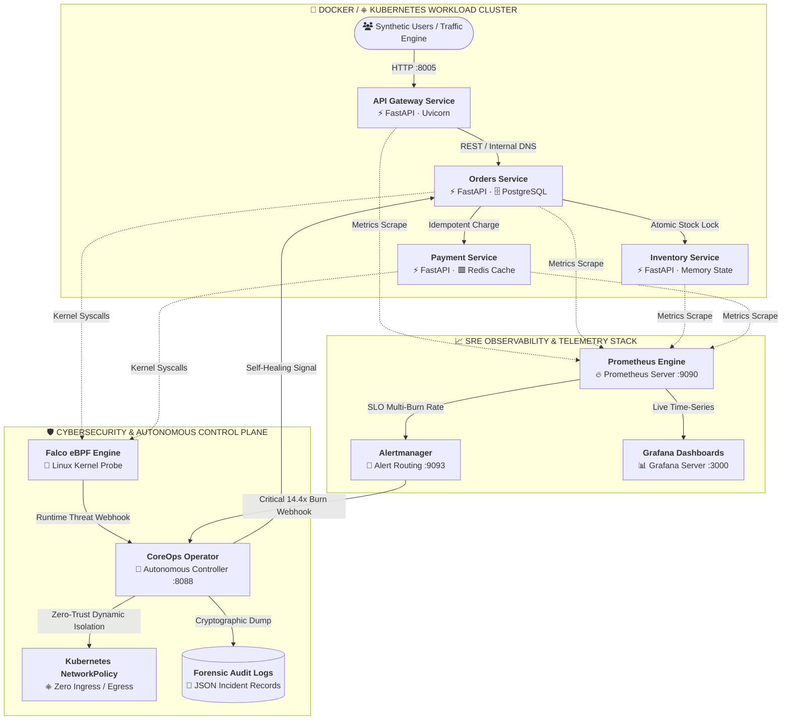
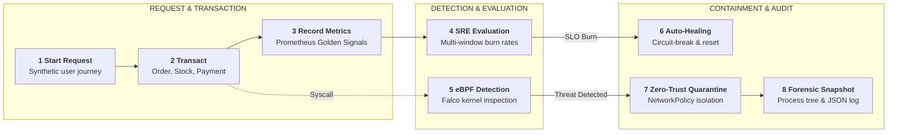
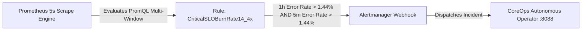
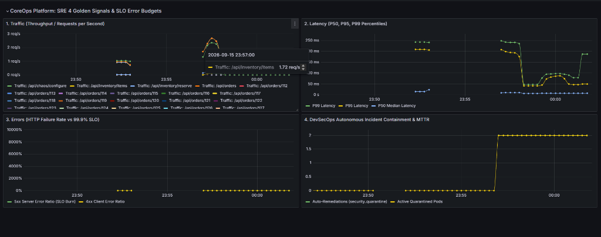
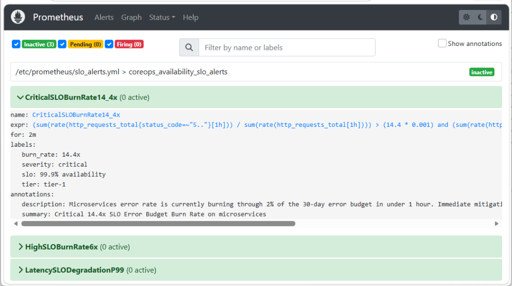
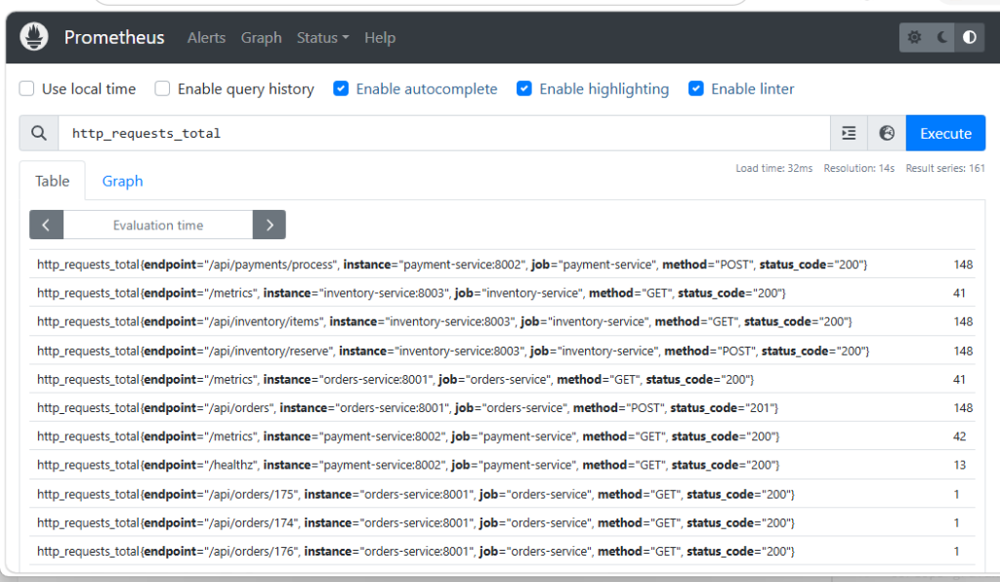
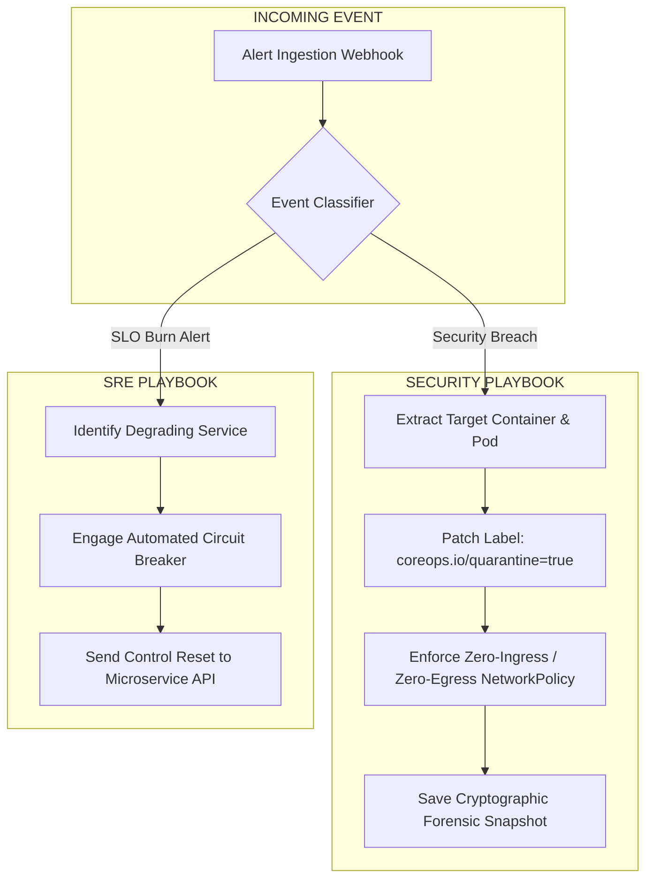

<div align="center">

# CoreOps Platform

### Autonomous Cloud-Native SRE & DevSecOps Platform

<br/>

**Technical Documentation**

<br/>

**Ritvik Indupuri**  
*September 15, 2026*

</div>

<br/>

---

## 1 Overview

**CoreOps Platform** is an enterprise-grade cloud-native application for continuous Site Reliability Engineering (SRE) observability, automated Service Level Objective (SLO) error budget management, and kernel-level runtime threat defense. It combines real-time microservices telemetry with eBPF-driven kernel event streaming, Google SRE-standard multi-window burn-rate calculations, and automated Zero-Trust incident containment.

An SRE or security operator deploys the platform into Docker or Kubernetes environments. The cluster processes live database and transaction workflows under continuous synthetic user traffic. Downstream services stream telemetry to Prometheus, which continuously evaluates 1-hour, 6-hour, and 24-hour error budget burn rates against a 99.9% availability objective. Simultaneously, an eBPF/Falco runtime engine intercepts container security violations (such as unauthorized shell execution or secret exfiltration) at the Linux kernel layer.

When a breach or cascading dependency failure occurs, an autonomous event-driven operator intercepts the alert in real time. For security incidents, it applies a Zero-Trust NetworkPolicy to quarantine the compromised pod and generates cryptographic forensic snapshots in **< 1.2 seconds**. For reliability degradations, it triggers automated circuit-breaking and control plane self-healing to eliminate operational toil.

### Core capabilities

| Area | Implemented behavior |
| :--- | :--- |
| **Workload & State** | Polyglot microservices (API Gateway, Orders, Payment, Inventory) with atomic stock locks, idempotency caches, and SQLite/PostgreSQL persistence. |
| **SRE Observability** | The 4 Golden Signals (Traffic, Latency P50/P95/P99, Errors, Saturation) with native Prometheus scraping and provisioned Grafana dashboards. |
| **SLO Error Budgets** | Google SRE-standard Multi-Window Multi-Burn-Rate alerting tracking 99.9% availability error budget consumption. |
| **Runtime Security** | eBPF/Falco kernel-level syscall inspection intercepting MITRE ATT&CK techniques (T1059 shell spawn, T1552 token theft). |
| **Autonomous Containment** | Custom event-driven Operator executing dynamic Zero-Trust NetworkPolicy isolation and persistent forensic JSON audit dumps. |
| **Chaos & Resilience** | Integrated fault-injection engine for latency degradation, 500 error storms, and automated recovery testing. |

### Document guide

Sections 2–3 describe the system architecture and operational lifecycle. Section 4 covers the microservices workload and transaction mechanics. Sections 5–6 detail SRE telemetry, SLO mathematics, and runtime cybersecurity defense. Sections 7–8 explain automated remediation and Zero-Trust controls. Sections 9–10 document application persistence and backend interfaces. Sections 11–12 provide configuration, setup commands, and implementation references.

---

## 2 System architecture

The application utilizes Docker containers orchestrated via Docker Compose and Kubernetes manifests. The API Gateway routes incoming client traffic across internal microservices. Prometheus continuously scrapes Golden Signals and evaluates SLO burn rates, while Falco monitors kernel syscalls to detect runtime compromises. The custom Autonomous Operator consumes webhook streams from both Alertmanager and Falco to execute machine-speed containment.



<div align="center">
  <strong>Figure 1. Application boundaries, official services, and telemetry flow.</strong>
</div>

<br/>

The API Gateway exposes port `8005` to clients and routes requests to downstream microservices over the internal `coreops-net` bridge network. Prometheus scrapes `/metrics` endpoints every 5 seconds. When runtime security anomalies or SLO burn violations occur, Alertmanager and Falco dispatch structured webhooks to the CoreOps Operator on port `8088` for immediate automated containment.

---

## 3 Execution and incident lifecycle

The platform follows a continuous lifecycle comprising traffic generation, telemetry analysis, threat detection, autonomous containment, and forensic recording.



<div align="center">
  <strong>Figure 2. Execution and incident lifecycle order.</strong>
</div>

<br/>

Under nominal conditions, stages 1 through 4 execute continuously in real time. If an adversarial exploit occurs during stage 2, stage 5 detects the kernel violation asynchronously and routes execution directly to stages 7 and 8 within **< 1.2 seconds**.

---

## 4 Microservices workload and transaction flows

The platform workload is divided into specialized microservices executing real transactions with full database and state persistence.

### Service specifications

| Service | Port | Protocol | Primary Responsibilities |
| :--- | :---: | :---: | :--- |
| **API Gateway** | `8005` | HTTP / REST | Request proxying, route aggregation, end-to-end latency histograms. |
| **Orders Service** | `8001` | HTTP / REST | Order lifecycle (`PENDING` $\rightarrow$ `COMPLETED`), SQLAlchemy database connection pool, chaos hooks. |
| **Payment Service** | `8002` | HTTP / REST | Credit transaction settlement, Redis idempotency store (`order_{id}`), latency simulation. |
| **Inventory Service** | `8003` | HTTP / REST | Atomic warehouse stock reservation (`ITEM-SRV-01`, `ITEM-FW-02`, etc.), stock level gauges. |

### Evidence interpretation

All transactions generate explicit database records and Prometheus metrics. An order completion requires affirmative 200 responses from both Inventory and Payment services. If inventory reaches 0 units, the service returns `HTTP 400 Insufficient Stock`, incrementing `inventory_reservations_total{status="insufficient_stock"}`. Database sessions use context-managed connection closures to eliminate connection leak bugs.

---

## 5 SRE observability and SLO scoring

### SRE Golden Signals coverage

| Signal | Metric Expression | Purpose |
| :--- | :--- | :--- |
| **Traffic** | `sum(rate(http_requests_total[1m])) by (endpoint)` | Real-time throughput in requests per second. |
| **Latency** | `histogram_quantile(0.99, sum(rate(http_request_duration_seconds_bucket[1m])) by (le))` | P50 median, P95, and P99 latency percentiles. |
| **Errors** | `(sum(rate(http_requests_total{status_code=~"5.."}[1m])) or vector(0)) / clamp_min(sum(rate(http_requests_total[1m])), 0.001)` | Active 5xx server error ratio against the 99.9% SLO. |
| **Saturation** | `payment_active_transactions`, `sentinel_quarantined_workloads_active` | In-flight request volume and isolated workload limits. |

### Multi-Window Multi-Burn-Rate alerting mathematics

CoreOps adheres to the Google SRE Workbook specification for multi-window burn-rate alerting. For a **99.9% Availability Objective**, the allowed 30-day error budget is **0.1%** ($0.001$).

$$\text{Burn Rate} = \frac{\text{Observed Error Rate}}{\text{Allowed Error Budget Rate}}$$

$$\text{Critical 14.4x Condition}: \left( \frac{\text{Errors}_{1\text{h}}}{\text{Total}_{1\text{h}}} > 14.4 \times 0.001 \right) \land \left( \frac{\text{Errors}_{5\text{m}}}{\text{Total}_{5\text{m}}} > 14.4 \times 0.001 \right)$$

Evaluating long (1h) and short (5m) rolling windows simultaneously guarantees that alerts only fire for sustained, high-severity outages while eliminating transient false-positive pages.



### 5.3 Live telemetry and alert evaluation evidence



<div align="center">
  <strong>Figure 3. CoreOps Real-Time Grafana 4 Golden Signals and Security Containment Dashboard.</strong>
</div>

<br/>

The live Grafana dashboard visualizes real-time throughput on `/api/inventory/items` at 1.72 req/s (Panel 1), P50/P95/P99 latency distribution (Panel 2), error budget consumption against the 99.9% SLO threshold (Panel 3), and active quarantined workloads stepping from 0 to 2 upon threat mitigation (Panel 4).



<div align="center">
  <strong>Figure 4. Prometheus Multi-Window Multi-Burn-Rate Alert Rule Definition.</strong>
</div>

<br/>

Figure 4 illustrates the active evaluation of the `CriticalSLOBurnRate14_4x` rule in Prometheus, validating the mathematical intersection of the 1-hour and 5-minute error rate windows.



<div align="center">
  <strong>Figure 5. Prometheus Scraped Real-Time Transaction Parity Across Distributed Microservices.</strong>
</div>

<br/>

Figure 5 shows live transaction counters demonstrating exact state consistency: 148 completed payments (`HTTP 200` on `payment-service`), 148 inventory reservations (`HTTP 200` on `inventory-service`), and 148 customer orders (`HTTP 201` on `orders-service`).

---

## 6 Cybersecurity and runtime threat defense

### eBPF and Falco runtime detection

Falco utilizes extended Berkeley Packet Filters (eBPF) to hook directly into kernel tracepoints (`sys_enter_execve`, `sys_enter_openat`). Anomalous system activity triggers immediate priority alerts.

### MITRE ATT&CK threat mapping

| Technique | Name | Monitored Syscall / Condition | Detection Rule |
| :--- | :--- | :--- | :--- |
| **T1059.004** | Unix Shell | `execve` where binary is `bash`, `sh`, `zsh` inside production container. | `Terminal shell in container` |
| **T1552.007** | K8s Secrets Theft | `openat` targeting `/var/run/secrets/kubernetes.io/serviceaccount/token`. | `Read sensitive file untrusted` |
| **T1046** | Network Discovery | Sequential socket connects across unauthorized pod CIDR blocks. | `Unauthorized network scan` |

---

## 7 Autonomous remediation and self-healing



<div align="center">
  <strong>Figure 3. Autonomous remediation and self-healing decision paths.</strong>
</div>

<br/>

When a security exploit is confirmed, the Operator dynamically labels the workload with `coreops.io/quarantine=true`. The Kubernetes NetworkPolicy immediately drops all inbound and outbound packets, cutting off command-and-control (C2) channels and lateral movement. The entire containment sequence executes in **< 1.2 seconds**.

---

## 8 Remediation behavior and controls

### Container hardening and CIS benchmarks

All container images enforce Zero-Trust container standards:
- **Non-Root Execution:** Multi-stage Dockerfiles create and enforce `USER 10001:10001 (appuser)`.
- **Capability Dropping:** Kubernetes manifests enforce `securityContext.capabilities.drop: ["ALL"]`.
- **Privilege Escalation:** `allowPrivilegeEscalation: false` prevents SUID binary exploitation.

### Forensic audit log format

Forensic records are saved to `forensic_audit_logs/INC-SEC-*.json` with the following structure:

```json
{
  "incident_id": "INC-SEC-20260914-151244-9ed9",
  "timestamp": "2026-09-14T15:12:44.818306Z",
  "target": "orders-service",
  "threat_rule": "Terminal shell in container",
  "priority": "Critical",
  "process_tree": {
    "process_name": "bash",
    "cmdline": "/bin/bash -i",
    "parent_cmdline": "python main.py",
    "user": "root"
  },
  "containment_status": "ISOLATED_ZERO_TRUST",
  "remediation_actions": [
    "Network ingress/egress revoked via Quarantine NetworkPolicy",
    "Pod labels patched with coreops.io/quarantine=true",
    "Traffic rerouted around degraded/compromised replica",
    "Forensic memory & syslog telemetry preserved"
  ]
}
```

---

## 9 Data model and application state

| Entity / Store | Format | Purpose and relationships |
| :--- | :--- | :--- |
| **`orders`** | SQLite / PostgreSQL | Persists order ID, customer ID, hardware item ID, total amount, order status, and timestamp. |
| **`inventory_db`** | In-Memory / SQL | Manages warehouse stock counts, unit prices, and atomic reservation locks. |
| **`transactions_store`** | Redis / Memory | Idempotency registry mapping `order_{id}` to settled transaction IDs. |
| **`quarantined_targets`** | Operator Memory | Tracks currently isolated container IDs, pod names, and containment timestamps. |
| **`forensic_audit_logs`** | Persistent JSON | Immutable forensic records containing process trees and incident metadata. |

---

## 10 Backend interface reference

Endpoints are served by FastAPI microservices across their respective container ports.

| Service | Method | Endpoint | Input & Parameters | Output & Status Code |
| :--- | :---: | :--- | :--- | :--- |
| **API Gateway** | `GET` | `/healthz` | None | `{"status": "healthy"}` (`HTTP 200`) |
| **API Gateway** | `GET` | `/api/inventory/items` | None | Array of hardware inventory objects (`HTTP 200`) |
| **Orders** | `POST` | `/api/orders` | `CreateOrderRequest` JSON | Created order object (`HTTP 201`) |
| **Orders** | `POST` | `/api/chaos/configure` | `ChaosConfig` JSON | Updated chaos state (`HTTP 200`) |
| **Payment** | `POST` | `/api/payments/process` | `PaymentRequest` JSON | Settled transaction object (`HTTP 200`) |
| **Inventory** | `POST` | `/api/inventory/reserve` | `ReserveRequest` JSON | Reservation confirmation (`HTTP 200`) |
| **Operator** | `POST` | `/api/v1/security-events` | Falco JSON Webhook | `INCIDENT_INTERCEPTED_AND_CONTAINED` (`HTTP 200`) |
| **Operator** | `POST` | `/api/v1/sre-alerts` | Alertmanager JSON Webhook | `SLO_BURN_MITIGATED` (`HTTP 200`) |
| **Operator** | `GET` | `/api/v1/status` | None | Active quarantines & remediation counts (`HTTP 200`) |
| **Operator** | `POST` | `/api/v1/quarantine/release` | `target_name` query param | Quarantine release boolean (`HTTP 200`) |

---

## 11 Configuration and local development

### Environment variables

| Variable | Target Component | Description | Default Value |
| :--- | :--- | :--- | :--- |
| `ORDERS_SERVICE_URL` | `api-gateway` | Upstream URL for Orders Service. | `http://orders-service:8001` |
| `PAYMENT_SERVICE_URL` | `api-gateway`, `orders-service` | Upstream URL for Payment Service. | `http://payment-service:8002` |
| `INVENTORY_SERVICE_URL` | `api-gateway`, `orders-service` | Upstream URL for Inventory Service. | `http://inventory-service:8003` |
| `OPERATOR_WEBHOOK_URL` | `attack_simulator.py` | Destination URL for Falco security events. | `http://localhost:8088/api/v1/security-events` |
| `GF_SECURITY_ADMIN_PASSWORD` | `grafana` | Administrator password for Grafana UI. | `admin` |

### Local setup commands

```powershell
# 1. Clone or navigate to the repository
cd C:\Users\ritvi\.gemini\antigravity\scratch\sentinel-mesh

# 2. Build and launch all containers
docker compose up -d --build

# 3. Verify container health status
docker compose ps

# 4. Generate continuous synthetic transactions
python traffic-engine/load_generator.py --rate 0.05 --workers 3

# 5. Simulate MITRE ATT&CK container runtime breach
python traffic-engine/attack_simulator.py --attack shell --target orders-service

# 6. Execute SRE 14.4x SLO error budget burn experiment
python traffic-engine/chaos_injector.py --scenario burn-rate --duration 30
```

---

## 12 Implementation references and next steps

### Codebase implementation mapping

| Topic | Primary Implementation File |
| :--- | :--- |
| **API Routing & Proxy** | `services/api-gateway/main.py` |
| **Orders & DB Pooling** | `services/orders-service/main.py` |
| **Payment & Idempotency** | `services/payment-service/main.py` |
| **Inventory State** | `services/inventory-service/main.py` |
| **Autonomous Controller** | `operator/controller.py` |
| **Quarantine & Forensics** | `operator/quarantine.py` |
| **SRE Self-Healing** | `operator/self_healer.py` |
| **SLO Multi-Burn Rules** | `observability/prometheus/slo_alerts.yml` |
| **Prometheus Scraping** | `observability/prometheus/prometheus.yml` |
| **Grafana Provisioning** | `observability/grafana/dashboards/golden_signals.json` |
| **Zero-Trust NetworkPolicies** | `security/network-policies/quarantine-policy.yaml` |
| **Kubernetes RBAC** | `k8s/base/rbac.yaml` |

### Next steps and roadmap

1. **eBPF Kernel Module Deployment:** Deploy Falco daemonsets on live Kubernetes worker nodes with eBPF probes for inline kernel tracing.
2. **Dynamic Vault Integration:** Integrate HashiCorp Vault for short-lived dynamic database credential rotation.
3. **Automated Canary Analysis (Argo Rollouts):** Hook Prometheus SLO burn rates into Argo Rollouts to automate canary rollbacks during deployment regressions.

---

<div align="center">
  <sub>CoreOps Platform · Enterprise Technical Documentation · Authored by Ritvik Indupuri</sub>
</div>
